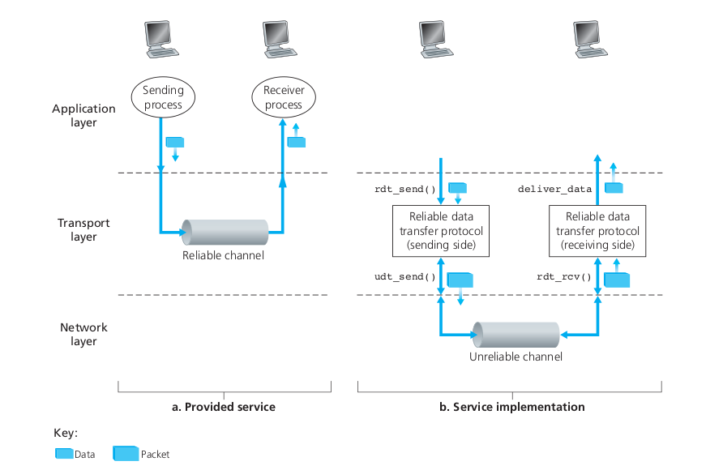
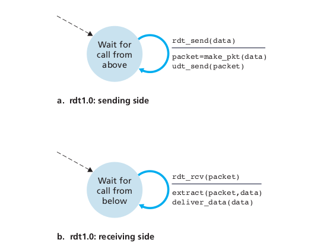

# Transport Layer

## Introduction and Transport Layer Services 

> A transport-layer protocol provides for logical communication between application processes running on different host.

The application processes can be present in different parts of the world and the information that the two processes send to each other are sent through the transport layer which ensures that the data is reached to the other end.

:warning: The transport layer protocols are implemented in the end systems, but not in network routers.

:exclamation: The computers that are connected to a computer network are sometimes referred to as end systems or end stations. 

The transport layer converts the message it receives from the application layer into transport-layer packets known as **transport layer segements**.

:warning: The message conversion is done by breaking the message into smaller chunks and adding a transport layer header.

The message is then sent to the network layer. The message then travels to the target computer through the network layer. When the message is passed to the network layer, the transport-layer segement is encapsulated with the network layer packet - **datagram**. 

:warning: The routers can access information of the network-layer segement. They cannot access the transport-layer information encapsualated in the network-layer segment. 

When the information reaches the other end, the network-layer extracts the transport-layer segment from the datagram and passes the information to the transport layer which then processes the information. The transport layer then passes the information to the application process present in the application layer.

### Relationship Between Transport and Network Layers

:warning: Transport layer provides logical communication **between processes** running on different hosts. 

:warning: The network layer on the other hand provides logical communication **between hosts**.

The transport layer lies just above the network layer.

The services provided by the transport layer is constrained by the underlying network layer. 

:warning: If the underlying network layer is unable to provide certain services then the transport layer also won't be able provide those services.

:warning: However, there are certain services that the transport layer can provide even though when it is not being provided by the network layer. 

### Overview of the Transport Layer 

The Internet (also known as the TCP/IP network) allows the application layer to use to two distinct transport layer protocols which are - 

1. **UDP**
1. **TCP**

:warning: **UDP** provides an unreliable, connectionless service to the invoking application.

:warning: **TCP** provides a reliable, connection-oreinted service to the invoking application.

:exclamation: When designing a network application, a developer must choose either of these transport layer protocols.

:warning: **RFC** stands for ```Remote Function Call```.

:warning: The transport layer packets are referred to as **segments**.

:warning: Network layer packets are referred to as **datagram**.

:boom: Internet's network layer protocol is referred to as **Internet Protocol**, also known as **IP**.

As mentioned above, **IP** provides logical communication between hosts.

:warning: The **IP** service model is based on **best-effort delivery service** which means that **```IP```** will try its level best to deliver the segements but it cannot guarentee anything. 

**```IP```** doesn't gaurentee the following -

1. It doesn't gaurentee segment delivery.
1. It doesn't gaurentee orderly delivery of segments.
1. It doesn't gaurentee the integrity of the data in the segments.

Hence, **```IP```** is said to be an ```unreliable service```. 

:exclamation: Every host has atleast one network-layer address, a so-called IP address.

:warning: The most fundamental reponsiblity of ```UDP``` and ```TCP``` is to extend **```IP's```** delivery service between two end system to a delivery service between two processes running on the end-systems. 

:warning: Extending host-to-host delivery process to process-to-process delivery system is called **transport-layer multiplexing** and **demultiplexing**.

#### UDP vs TCP

Both ```UDP``` and ```TCP``` provide integrity checking by including error-detection fields in their segments' headers. 

1.  **UDP**

    It only provides two minimal services which are as follows - 

    1. Proces-to-process message delivery
    1. Error checking

    :warning: ```UDP``` like ```IP``` provides unreliable service (i.e. it does not gaurentee that data sent by one proces will arrive intact or at all to the destination process)

1.  **TCP**

    Unlike ```UDP```, ```TCP``` provides **reliable data transfer**. 

    ```TCP``` makes use of serveral techniques to ensure that the data being sent by the sending process is received by the receiving process, that too **correctly** and **in-order**. 

    ```TCP``` thus converts ```IP's``` unreliable service between end-systems to a reliable data transport service between processes. 

    ```TCP``` also provides ```congestion control```. Congestion control is not used by the application invoking the service, instead it is service for the Internet as a whole. 

    > TCP congestion control prevents any one TCP connection from swamping the links and routers between communicating hosts with an excessive amount of traffic. 

    > This is done by regulating the rate at which the sending sides of TCP connections can send traffic into the network. 

:warning: ```UDP``` unlike ```TCP``` is unregulated, which means that ```UDP``` can send data at any rate it pleases and that too for as long as it pleases.

## Multiplexing and Demultiplexing 

:warning: A ```multiplexing/demultiplexing``` system is needed by all computer networks.

At the receiving host, when a message arrives the transport-layer receives the segements from the network-layer. The transport layer then has to send the message to the appropriate process present on the appropriate socket.

:warning: The transport layer however delivers the data to the intermediary socket. The receiving host can have many sockets. Each socket has a unique identifer and the format of the identifier depends upon whether the socket is a ```UDP socket``` or a ```TCP socket```.

When the transport-layer receives the segment, it reads the various fields present in the segment and then directs the message to the appropriate socket. 

:warning: The job of delivering the data in the transport-layer segment to the correct socket is called **demultiplexing**. 

:warning: The job of gathering data chunks from various sockets at the source host, encapsulating each data chunk with header information to create segements, passing the segments to the network layer is called **multiplexing**.

Transport-layer multiplexing requires the following - 

1. that sockets have unique identifiers. 
1. that each segment have special fields that indicate the socket to which the segment is to be delivered. These fields are the **source port number** and the **destination port number**.

Each port number is a 16-bit number, ranging from 0-65535. 

The port numbers ranging from 0-1023 are called **well-known port numbers** and are restricted, which means they are reserved for the use by well-known application protocols like ```HTTP(Port number 80)```, ```FTP(Port number 21)``` etc.

Here is how a demultiplexing service is implemented - 

Each socket in the host is assigned a port number, and when a segment arrives at the host, the transport layer examines the destination port number in the segment and directs the segment to the corresponding socket. 

The segment's data then passes through the socket into the attached process. This is how demultiplexing works in ```UDP```, however for TCP the process is a bit different.

## Connectionless Multiplexing and Demultiplexing 

:warning: Transport layer assigns a port in the range 1024 to 65535 that is currently not being used by any other ```UDP``` port in the host.

Typically, the client side of the application lets the transport layer automatically assign the port number, whereas the server side of the application assigns a specific port number.

To understand multiplexing and demultiplexing in a ```UDP``` network, let us consider two hosts A and B which have 1025 and 1045 as their port numbers respectively. 

On the host side, the data from the port 1025 is taken by the transport layer and converted into a segment with approporiate information filled in the header. The segment is then taken up by the network layer which encapsulates the segment inside the network-layer datagram and makes a best-effort attempt to deliver the information to the host A. 

On the receiving side, if the data reaches from host B, the transport layer examines the segment and delivers the data to correct socket depending upon the value present in the destination port. 

:boom: Note that with UDP there is no handshaking between sending and receiving transport-layer entities before sending a segment. For this reason, UDP is said to be connectionless.

:warning: The server uses the ```source port number``` to send an acknowledgment message back to the client. Hence, the source port number is also specified in the header of the transport-layer segment.

:warning: Here, if two ```UDP``` segments have different source ```IP``` addresses and/or source port number, but have the same destination ```IP``` address and destination port number, then the two segments will be directed to the same destination process via the same destinatoin socket.

## Connection-Oriented Multiplexing and Demultiplexing

:warning: A ```UDP``` is identified by a two-tuple, but the ```TCP``` on the other hand is identifed by a four-tuple. 

In case of a ```TCP``` network, the following are required - 

1. Source IP Address
1. Source Port Number 
1. Destination IP Address
1. Destination Port Number

The following occurs when a host sends a message to the receiver - 

1. The server initially waits for a clients on port number 1200.
1. The ```TCP``` client creates a socket and sends a connection-establishment-request.
1. The connection-establishment-request is a TCP Segment with destination port number 12000 and a special connection-establishment bit set in the ```TCP``` header.
1. When the host OS of the computer running the server process receives the incoming connection-request segment with the destination port 12000, it locates the server process that is waiting to accept a connection on port number 12000.
1. Then a socket is created.
1. The transport layer at the server notes the four-tuple values present in the transport-layer segment.
1. If the information present in the segment matches with the information of the process, then the data from the segment is passed on to the process through the socket.

:warning: All four fields of the ```TCP``` segment are used direct the segment to the appropriate socket.

:warning: If two ```TCP``` segments with different source ```IP``` address and ```port number``` but with the same destination ```IP``` address and ```port number``` are sent to a host, it will be directed to two different sockets unlike with what happens in ```UDP```.

## Web Servers and TCP

> If the client and server are using persistent HTTP, then throughout the duration of the persistent connection the client and server exchange HTTP messages via the same server socket. 

> However, if the client and server use non-persistent ```HTTP```, then a new ```TCP``` connection is created and closed for every request/response, and hence a new socket is created and later closed for every request/response. 

:warning: This frequent opening and closing of sockets can severely impact the performance of a busy Web server.

## Connectionless Transport: UDP

**```UDP```** is said to be **connectionless** because there is no hand-shaking between sendng and receiving transport-layer entities before sending a segment. 

```UDP``` is a ```vacuous transport protocol```.

```UDP``` does very little to extend the network layer, it only adds multiplexing/demultiplexing and some error checking to ```IP```.

:warning: ```UDP``` is almost directly talking with ```IP```. 

Tht following steps takes place when ```UDP``` is used -

1. It takes messages from the application process and attaches ```source port number``` and ```destination port number``` for multiplexing/demultiplexing service.
1. It adds two small fields to the segment and passes the resulting segment to the network layer.
1. The network layer encapsulates the segment into an ```IP datagram``` and makes a best-effort attempt to deliver the segment to the receiving host. 
1. If the segment arrives at the host, ```UDP``` uses the destination port number to deliver the segment's data to the application process.

## Working of DNS with UDP

```DNS``` is an application-layer protocol that uses ```UDP```. 

The following steps takes place when ```DNS``` uses ```UDP``` - 

1. When the ```DNS``` application in a host wants to make a query, it constructs a DNS query message and passes the message to the ```UDP```.
1. The host-side ```UDP``` adds header information to the data and then sends the segment to the network-layer without performing any handshaking. 
1. The network layer then encapsulates the data into an ```IP``` datagram and makes it best-effort attempt to send the query to the name server. 
1. If the query is received by the name server, the segement is given to the transport layer which demultiplexes it and hands the data over to the application process. 
1. The ```DNS``` application at the querying host then waits for a reply from the name server. If it is unable to get the reply (either due to the query or the reply getting lost), then the ```DNS``` host application will query send the query to anther name server or it informs the invoking application that it can't reply. 

## Preference of UDP over TCP

Below mentioned are the reasons why ```UDP``` is preferred over ```TCP``` - 

1.  **Finer application-level control over what data is sent and when** 

    Under ```UDP``` as soon as the data is being passed from the application process, the ```UDP``` adds a few header files to the segment and then sends the segment to the network layer. 

    ```TCP``` on the other hand has a congestion control mechanism which throttles the transport-layer TCP sender when one or more links between the source and destination port becomes excessively congested. 

    ```TCP``` will also continue to resend a segment until the destination process acknowledges the delivery of the segment regardless of how long reliable delivery takes. 

    Thus, for applications that require data to be transmitted quickly, ```TCP``` will be a bad choice. The application developer can use ```UDP``` and extra features to it, depending upon the requirement. 

1.  **No connection establishment**

    In ```UDP``` there is no preliminary handshaking unlike ```TCP``` which performs a three-way handshaking before sending the data. 


    Because of the three-way handshaking, ```TCP``` is slower compared to ```UDP```. Thus, ```DNS``` makes use of ```UDP``` and not ```TCP```. 

    However, ```HTTP``` makes use ```TCP``` and not ```UDP``` because reliability for web pages is crucially important. Since, ```HTTP``` uses ```TCP``` it takes some time to load webpages in the web-browser.

1. **No connection state**

    ```TCP``` maintains connection state in the end systems. This connection state includes receive and send buffers, congestion control parameters, sequence and acknowledgement number parameters etc. 

    ```TCP``` needs to maintain these parameters because it provides reliable service and congestion control.

    ```UDP``` on the other hand does not maintain any such connection pararmeters. 

    Hence an application that supports ```UDP``` can run many more clients when compared to ```TCP```. 

1.  **Small packet header overhead**

    ```TCP``` segment has over 20 bytes of header overhead whereas in case of ```UDP``` the header overhead is only of 8 bytes. 


Below mentioned are the cases where ```UDP``` is used - 

1. RIP 
1. Used to carry network managment data (SNMP)
1. DNS

:warning: ```UDP``` unlike ```TCP``` has no congestion-control mechanism which if not controlled can lead to a lot of packet overflow at the routers which in turn would result in high loss rates between a ```UDP``` sender and receiver.

:boom: It is possible to achieve reliable data transfer in ```UDP```. But it has to be built into the application itself. 

### UDP Segment Structure

The ```UDP``` segment looks like this - 

<p align="center"></p>

The application data is stored in the data field of the ```UDP``` segment. 

The ```UDP``` header has only 4 fields. The first two fields are for the ```source port number``` and the ```destination port number```. The next two fields are for length and checksum. 

:boom:The length specifies the number of bytes of the ```UDP``` segment(header + data). 

:exclamation: an explicit length value is needed as the data field may vary from one segment to another. 

:warning: The size of the header field in the ```UDP``` segment is fixed and it is of 8 bytes. 

:boom: The checksum is used by the receiving host to check for errors in the segment. 

:exclamation: The checksum is also calculated in the ```IP``` header.

### UDP Checksum

The checksum is used for error detection. It is used to determine if the bits in the segment have been altered or not as it moved from source to destination. 

:warning: Although ```UDP``` provides error-checking, it does no do anything to recover from an error. 

:boom: Some implementations send the data to the application process with a warning, others simply discard the data. 

Below mentioned are the steps that are used in error checking - 

1.  Sum all the 16-bit numbers.
    
    :warning: If there is an overflow, wrap the extra bit.

1.  Perform ones compliment to the resulting sum. The resulting sum is the checksum that is added to the checksum field in the segment. 

1.  On the receiving side, all the 16-bit values are summed with checksum. If the resulting value is **all ones**, then no errors are present in the segment. 

Below mmentioned are the reasons error checking is being provided by ```UDP``` - 

1. Even when the segments are safely, there is no gaurentee that the bits will be stored in the routers properly. Errors might be introduced to the segment when the segment is stored in the router. 

1. Also, there is no gaurentee that all links provided by the link-layer protocols provide error checking. 


:warning: Hence, ```UDP``` must provide end-to-end error checking. 

## Principles of Reliable Data Transfer

The following needs to be provided by a **Reliable Data Transfer Protocol** -

1. No transferred bits are corrupted, i.e no bits in the segment are flipped from 1 to 0 or vice-versa. 
1. No transferred data is lost.
1. All the transferred data is delivered in the order in which they are sent.

:warning: It is the task of a **Reliable Data Transfer Protocol** to implement this service abstraction.

:boom: The task of implementing a **Reliable Data Transfer Protocol** is made difficult by the fact that the underlying protocol could be unreliable.

:exclamation: While providing an implementation for the **Reliable Data Transfer Protocol (RDT)** we'll assume that the data will not reordered when it is being transferred, however the data can get lost or get corrupted. 

:warning: Also, only unidirectional data transfer will be considered for now. 

:exclamation: **rdt** stands for ```Reliable Data Transfer``` whereas **udt** stands for ```Unreliable Data Transfer```. 

Please look at the figure below to get a better idea. 

<p align="center"></p>

### Building a Reliable Data Tranfer Protocol 

Reliable Data Transfer Protocol is often abbreviated as ```RDT```. Below mentioned are the various ways in which it can be implemented.  

#### RDT over a Perfectly Reliable Channel : rdt1.0

The FSM (Finite State Machine) for the both the receiver and the sender are shown in the below figure - 

<p align="center"></p>


A few things that have to kept in mind while looking at the figure is that - 

1.  The event causing the transition is shown above the horizontal line labeling the transition.
1.  The action taken when the event occurs is shown below the horizontal line. 
1.  The dashed line represents the initial state of the FSM. 
1.  When action is taken or  when no event occurs, ```^``` symbol is used.

##### rdt sending side

Please have a look at the figure above. The data is first sent from the reliable application-layer to the transport layer through ```rdt_send()```. This is done by first packaging the data and then sending it to the network-layer through ```udt_send()```.   

##### rdt receiving side

Again, please have a look at the figure. At the receiving side, ```rdt_rcv(pkt)``` receives the data from the network-layer and then sends it to the transport-layer. At the transport-layer the data from the packet is extracted and is then delivered to the application-layer. 

:warning: Since, in ```rdt 1.0``` we have assumed that we have a perfectly reliable channel, there is no need for the receiver to send feedback to the sender. Also, we are assuming that the receiver is able to receive the data as soon as the sender sends it. 

#### RDT over a Channel with Bit Errors : rdt2.0

This is more realistic model as this cosiders the possibility of corruption of data during data transit. The bit errors are generated because of the physical components of a network as packects are transported. 

:boom: In this model there is no data loss and there is no re-ordering of data that is transported. 

Here a ```message-detection protocol``` is used where both ```positive acknowedgements (OK)``` and ```negative acknowledgements(please repeat again)``` are used. If the receiver in such a protocol receives corrupted data, it asks the sender to send the data again. 

:exclamation: RDT protocols based on such retransmission are known as ```ARQ(Automatic Repeat reQuest)``` protocols.

Fundamentally, ```ARQ``` protocols require the following **three additional capabilities** - 

1.  **Error detection**

    A mechanism is required which can detect bit errors at the receiver side. This mechanism hence requires additional bits beyond the original bits to sent by the sender to the reciever.

1.  **Receiver feedback**

    In order for the sender to know whether the receiver received the packet with any bit loss the receiver has to send some sort of a feedback. This feedback can be in the form of ```ACK``` or ```NAK```. The ```ACK``` and ```NAK``` need to be 1 bit long only and can contain the value of either 1 or 0. 

    :warning: ```0 refers to NAK``` and  ```1 refers to ACK``` 

1.  **Retransmission**

    A packet that is received by the receiver if found to be corrupt needs to be retransmitted. 


The FSM for the receiver and sender of rdt2.0 can be found below - 

<p align="center"></p>

##### rdt2.0 sending side

The sending side contains a ```FSM``` with two states. The first state sends the packet to the receiver and the second state waits for the response (```ACK``` or ```NAK```) from the receiver. 

If the second state receives an ```ACK``` as the response, it simply goes back to the first state as the packet has been sent to the receiver without any data corruption. Hence ```^``` is present below the horizontal line. 

On the other hand if the data that is sent to the reciever gets corrupted in transit, the sender receives a ```NAK```. As a response, it sends the packet again to the receiver.

:boom: When the sender waits for the response from the receiver it connot send any more packet(s) unless it receives a response from the receiver. Hence, this protocol is also termed as **stop and wait protocol** as the sender has to stop and wait for the response from the receiver.

##### rdt2.0 receiving side 

```FSM``` for the receiver only has one state. 

When the receiver receives a data packet and the packet is not corrupt (i.e ```rdt_rcv(packet) && is_corrupt()``` is true), the receiver creats a packet with ```ACK``` and sends it to the sender. 

On the other hand when the receiver receives a data packet that is corrupt, it creates a packet with a ```NAK``` and sends it to the sender. 

:boom: The above mechanism however has a serious flaw. If the ```ACK``` or the ```NAK``` that is being sent to the sender gets corrupt, the sender won't be able to know. This flaw has been addressed in ```rdt2.1``` which is explained in the next section.

#### RDT over a Channel with Bit Errors : rdt2.1

```rdt2.1``` addresses the shortcomings of ```rdt2.0```. In ```rdt2.1``` each data packet that is being sent to the receiver has a ```modulo-2``` **sequence number** associated with it. Whenever the sender receives a garbled ```ACK``` or ```NAK``` it sends the data packet again. 

Once the sender receives the data packet, it checks the ```sequence number``` of the previously received data packet, if it's the same then it has received the re-transmitted packet and if the sequence number doesn't match with previuos data packet then it has received a new data-packet. 

This way the sender and the receiver are able to get the proper data packet without any corruption. 

:boom: modulo-2 means binary numbers (i.e ```1``` or ```0```)

##### rdt2.1 sender

The FSM for ```rdt2.1``` can be found below - 

<p align="center"></p>

The ```FSM``` for the sender here has 4 states. The first two states send the data packet with ```sequence number 0``` and the last two states send the data packet with ```sequence number 1```. 

The first state sends the data packet. The second state checks if the received packet is corrupt or if it is a ```NAK```. If either of them is true, it sends the data packet again. On the other hand if the data packet received is not corrupt and ```ACK``` is also received, the FSM goes to the next state where it sends the data packet with the ```sequence number 1```. 

Again, the third state checks whether the data packet received is corrupt or if ```NAK``` is received.

##### rdt2.1 receiver

The ```FSM``` for rtd2.1 can be found below - 

<p align="center"></p>

The ```FSM``` for ```rdt2.1``` has two states. 

In the ```first state``` if the receiver at state 0 receives the data packet with the sequence number of 0 it moves to the next state. On the other hand if it receives either corrupt data or data with the previous sequence number, it sends the ```NAK``` and ```ACK``` resppectively back to the sender.

The next state does the name thing but with the sequence number of 1. The receiver in this state waits for the data packet of sequence number 1. If the data packet is not corrupt or if the data packet received is not a duplicate of the previous data packet, the FSM goes to the next state else it stays in the current state. 

#### RDT over a Channel with Bit Errors : rdt2.2

The ```rdt2.2``` protocol is a bit different form the ```rdt2.1``` protocol in terms of how the receiver sends response back to the sender. In ```rdt2.2``` the receiver only uses ```ACK``` as a response. If the receiver gets a corrupted data packet, it sends the ```ACK``` of the previously received data packet to the sender. 

Now, if the sender receives an ```ACK``` of the previously recieved data packet it has to retransmit the data. 

:boom: Here the ```ACK``` of the last correctly received packet is sent as substitute for ```NAK```. In other words **duplicate ACKs** are sent.

##### rdt2.2 sender

The ```FSM``` for ```rdt2.2``` can be found below - 

<p align="center"></p>

The ```FSM``` for ```rdt2.2``` also has 4 states. The only difference here is that now instead of checking for a ```NAK``` at the 2nd and 4th state it'll be checking if the ACK received is new or not. If it's old then the sender will have to send the data packet again. 

##### rdt2.2 receiver 

The FSM for rdt2.2 can be found below - 

<p align="center"></p>

The ```rdt2.2``` receiver is a bit similar to the ```rdt2.1``` receiver, the only difference being that instead of sending a ```NAK``` when the data packet received is corrupt or out-of-sync, the ```rdt2.2``` receiver sends a ```ACK``` of the previously received data packet.

#### Reliable Data Transfer over a Lossy Channel with Bit Errors: rdt3.0

```rdt3.0``` is applicable to real-time scenarios where there is both loss and corruption of data.

The loss of data can occur in the following ways -

1.  The data packet is lost in transit and it never reaches the receiver.

1.  The respose from the receiver is lost and it never reached the sender. 

1.  The sender sends the data packet but it takes a lot to send the packet. 

If the first two cases occur, the sender will have get notification about it. In order to fix such an issue the concept of timers can be used. A timer can be set-up which will retransmit the data after a timeout occurs in the timer.

Since the data packets will be retransmitted again ```duplicate data packets``` will be sent to reciver but ```rdt2.2``` already has a solution for that issue. 

Then burden of the data packet loss problem will be entirely taken up by the sender. The sender will thus have to perform the following - 

1.  Start the timer each time a packet is sent
1.  Respond to a timer interrupt
1.  Stop the timer

:warning: ```rtd3.0``` is also at times referred to as the **alternating bit-protocol**. 

##### rdt3.0 sender

The ```FSM``` for ```rdt3.0``` can be found below - 

<p align="center"></p>

This ```FSM``` is like the ```rdt2.2``` which has 4 states. The only difference here being that the whenever the sender sends the data the timer has to started. And whenever the sender receives a corrupt or a delayed response, the ```FSM``` will retransmit the data. 

:warning: All of the ```rdt``` models mentioned above are built on top of the inherit ```stop and wait protocol```. 

### Piplined Reliable Data Transfer Protocols

The figure below shows the contrast between a stop-and-wait protocol and a pipelined protocol. 

<p align="center"></p>

