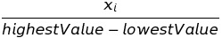
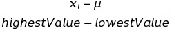
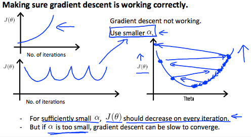
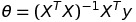

# Gradient Descent

This document will contain my notes on Gradient Descent. 

## What is gradient descent?

Gradient Descent is an optimization algorithm which optimizes a function by finding a value for the function which gives it a minimum value. 

The function is usually in terms of its parameters and gradient descent finds a value for the parameters such that the function gives a minimum value. 

:warning: The gradient descent algorithm only gives correct result with convex functions. If a function is not convex the result might be incorrect. 

Here is a plot of gradient descent in action- 

<p align="center"></p>

## Equation for Gradient Descent

Gradient Descent can be mathematically represented as follows - 

<p align="center"></p>

here ```j = [0, 1]```. 

and ```aplha``` is the ```learning rate```.

:warning: In gradient descent we always go for simultaneous update. 

Simulataneous update looks like this - 

<p align="center"></p>

## Algorithm

Depending on the type of gradient descent being used, the algorithm can vary. Here, we will be discussing the algorithm for vanilla full batch gradient descent. 

The algorithm for gradient descent is as follows - 

1.  Choose an appropriate value for the learning rate(alpha).
1.  Initialize the parameters of the cost function to some value.
1.  Calculate the differential of the cost function.
1.  Substitute the value into the gradient descent equation. 
1.  Then perform simultaneous update of the parameters until the algorithm converges (i.e. appropriate values of the cost function are found).

## Important points

Gradient descent only works for convex functions. If a non-convex function is used for gradient descent, it may not yield the global optimum(i.e the lowest point in the mountain).  

Another important thing to keep in mind performing gradient descent is to choose an appropriate value for the learning rate(alpha). If the value of the learning rate is too high the algorithm may either fail to converge or it may diverge. At the same time, if the value of the learning rate is too small the algorithm will take a lot of time to converge.  

Also, there are different types of gradient descent algorithms. [This](https://www.analyticsvidhya.com/blog/2017/03/introduction-to-gradient-descent-algorithm-along-its-variants/) is an interesting article which talks about the different types of gradient descent algorithms. 

## Practical Tricks make Gradient Descent work well

Gradient Descent tends to work better if all the values of the feature set are in the range of ```[1, -1]```. If the range of values are not in this range or if the values of each of the feature set differ too much from each other too much, then gradient descent might take a lot of time to converge. Also, for such data the contour plots are very skewed and skinny. The more skinner or skewed the contour plot is, the more time it'll take to converge. 

There are two ways to fix this problem - 

1.  **Feature Scaling**

    Here, we calculate the range of the feature set and then divide each value of the feature set by it. The range can be found by subtracting the highest value with the lowest value of the feature set.  

    <p align="center"></p>

1.  **Mean Normalization**

    Mean Normalization also involves doing something similar to ```Feature Scaling```. Here, we take each element, subtract it by its mean and then divide it by its range or standard deviation. 

    <p align="center"></p>

## Choosing the learning rate (Alpha)

We can also check whether gradient descent is working properly or not by plotting the cost function (J) against the number of itearations. If the resulting plot is decreasing with the number of iterations, then we can say that gradient descent is working properly. 

If teh graph decreases after a lot of itearations then it could be possible that the value of alpha that we have choosen is too less. On the contrary, if the graph is decreasing and is rather increasing then the learning rate is too large and needs to be decreased. 

Plotting the cost function against the number of iteartions is really good approach to figure out if gradient descent is working properly or not. 

Below are a few plots between J and the number of iterations. 

<p align="center"></p>  

**Automatic Convergence Test**

There is yet another way in which we can find out whether gradient descent is working properly or not. The automatic convergence test checks if J(θ) decreases by less than E in one iteration, where E is some small value such as ```10^-3```. However, in practice it is quite difficult to find appropriate value for E. 

To summarize:

If alpha is too small: slow convergence.

If alpha is too large: may not decrease on every iteration and thus may not converge.

# Normal Equation

In certain cases we can make use of the normal equation to get the parameters for our model. 

In the "Normal Equation" method, we will minimize J by explicitly taking its derivatives with respect to the θj ’s, and setting them to zero. This allows us to find the optimum theta without iteration. 

The normal equation is as follows - 

<p align="center"></p> 

:warning: There is no need to do feature scaling with the normal equation.

Comparision between Gradient Descent and Normal Equation can be found below - 

| Gradient Descent           | Normal Equation                                 |
|----------------------------|-------------------------------------------------|
| Need to choose alpha       | No need to choose alpha                         |
| Needs many iterations      | No need to iterate                              |
| O (kn^2kn2)                | O (n^3n3), need to calculate inverse of X^TXXTX |
| Works well when n is large | Slow if n is very large                         |

:boom: Normal Equation might not be a good option of the number of features exceeds 10,000. Normal equation becomes quite slow when the value of ```n``` is very large.

## Noninvertibility

Another thing that we have to keep in mind about the normal equation is invertibility. 

Since, the equation has term which requires calculating the inverse of (X<sup>T</sup>X). In certain cases, it may not be possible to calculate the inverse. 

If inverse term happens to be noninvertible, the common causes might be having :

1.  Redundant features, where two features are very closely related (i.e. they are linearly dependent)
1.  Too many features (e.g. m ≤ n). In this case, delete some features or use "regularization" (to be explained in a later lesson).

Solutions to the above problems include deleting a feature that is linearly dependent with another or deleting one or more features when there are too many features.