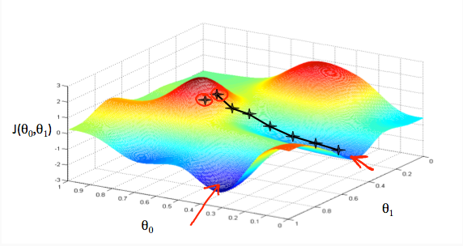
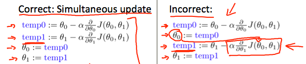

# Gradient Descent

This document will contain my notes on Gradient Descent. 

## What is gradient descent?

Gradient Descent is an optimization algorithm which optimizes a function by finding a value for the function which gives it a minimum value. 

The function is usually in terms of its parameters and gradient descent finds a value for the parameters such that the function gives a minimum value. 

:warning: The gradient descent algorithm only gives correct result with convex functions. If a function is not convex the result might be incorrect. 

Here is a plot of gradient descent in action- 

<p align="center"></p>

## Equation for Gradient Descent

Gradient Descent can be mathematically represented as follows - 

<p align="center"></p>

here ```j = [0, 1]```. 

and ```aplha``` is the ```learning rate```.

:warning: In gradient descent we always go for simultaneous update. 

Simulataneous update looks like this - 

<p align="center"></p>

## Algorithm

Depending on the type of gradient descent being used, the algorithm can vary. Here, we will be discussing the algorithm for vanilla full batch gradient descent. 

The algorithm for gradient descent is as follows - 

1.  Choose an appropriate value for the learning rate(alpha).
1.  Initialize the parameters of the cost function to some value.
1.  Calculate the differential of the cost function.
1.  Substitute the value into the gradient descent equation. 
1.  Then perform simultaneous update of the parameters until the algorithm converges (i.e. appropriate values of the cost function are found).

## Important points

Gradient descent only works for convex functions. If a non-convex function is used for gradient descent, it may not yield the global optimum(i.e the lowest point in the mountain).  

Another important thing to keep in mind performing gradient descent is to choose an appropriate value for the learning rate(alpha). If the value of the learning rate is too high the algorithm may either fail to converge or it may diverge. At the same time, if the value of the learning rate is too small the algorithm will take a lot of time to converge.  

Also, there are different types of gradient descent algorithms. [This](https://www.analyticsvidhya.com/blog/2017/03/introduction-to-gradient-descent-algorithm-along-its-variants/) is an interesting article which talks about the different types of gradient descent algorithms. 