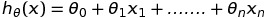
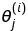
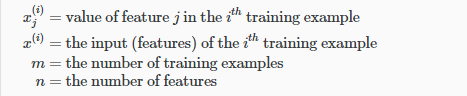
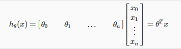

# Multivariate Linear Regression

Multivariate Linear Regression takes multiple features and tries to predict the output based on the feature set.

## Hypothesis

The hypothesis for Multivariate Linear Regression will be as follows -  

where x0 = 1

Also, in case of multivariate linear regression, we follow the following convention - 

where i = row and j=column of the feature set.

Here is the summary for the same - 

The hypothesis can also be written in the form of matrix multiplication which is as follows - 

