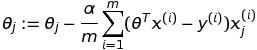
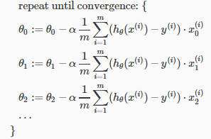
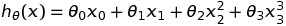
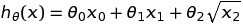

# Multivariate Linear Regression

Multivariate Linear Regression takes multiple features and tries to predict the output based on the feature set.

## Hypothesis

The hypothesis for Multivariate Linear Regression will be as follows -  

<p align="center"></p>

where x<sub>0</sub> = 1

Also, in case of multivariate linear regression, we follow the following convention - 

<p align="center"></p>

where i = row(i.e. 0...m) and j=column(i.e. 0..n) of the feature set.

m=> No of training samples
n=> No of features

Here is the summary for the same - 

<p align="center"></p>

The hypothesis can also be written in the form of matrix multiplication which is as follows - 

<p align="center"></p>

## Gradient Descent 

The batch gradient descent algorithm for multivariate linear regression only requires a slight modification. Here, we calculate the partial derivative in terms of all the feature columns. 

The equation for gradient equation then becomes somewhat like this - 

<p align="center"></p>

```Where j=0, 1, 2, 3, ..... n columns```

:warning: And the values of theta will have to be updated simultaneously. 

Again, the below mentioned picture summarizes gradient descent for the multivariate linear regression quite well

<p align="center"></p>

## Features and Polynomial Regression

Apart from feature scaling and mean normalization we can also make use of another technique to enhance the performance of the gradient descent. 

We can combine features together to obtain a new feature set. For instance, we can take two features x<sub>1</sub>, x<sub>2</sub> and combine them to obtain a new feature x<sub>3</sub>. 

# Polynomial Regression

In certain cases, a linear hypothesis might not fit the data well and so we may have to choose polynomial hypothesis ( i.e. quadratic/cubic). 

A polynomial hypothesis can model the data set well in certain cases. 

Below are a few exmaples of polynomial regression -

<p align="center"></p>

<p align="center"></p>


We however don't have to manually choose the type of the hypothesis (i.e. whether it should be linear/quadratic/cubic). The type of the hypothesis can be choosen automatically by another algorithm.

:warning: In case of polynomial regression feature scaling and mean normalization become very important as the value of each feature set becomes quite large.