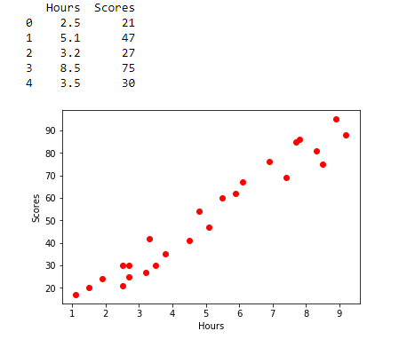
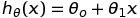
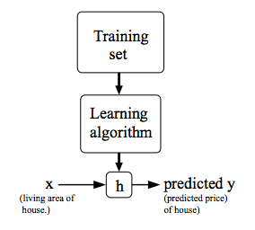
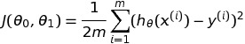
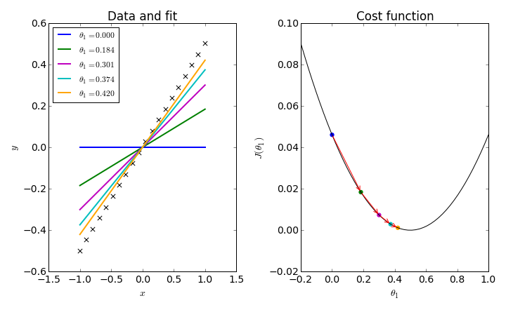
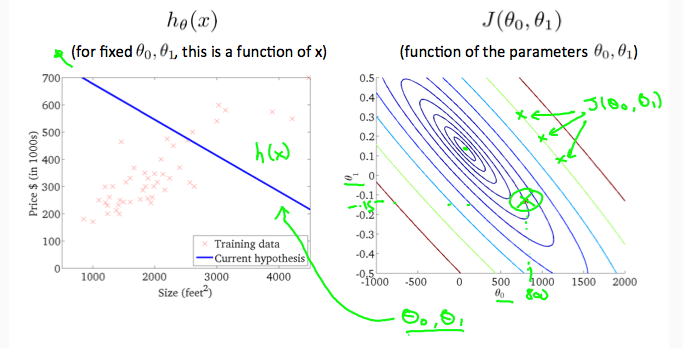
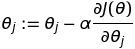
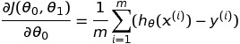
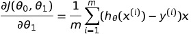
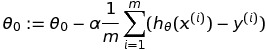

# Linear Regression

This document will contain my notes on Linear Regression. 

## What is Linear Regression?

Linear Regression is a type of supervised learning algorithm that learns labelled data and predicts the output based on what it has learned. 

Let's take an sample data set and try to understand what linear regression means. 

The following data contains the ```number of hours a student studies``` and his/her ```grades```.

A sample plot can be found below -

<p align="center"></p>

:boom: What we want to predict from the data is the score of a student given the number of hours a student studies. 

This can be done with the help of a hypothesis. 

### What is a hypothesis?

A ```hypothesis``` is a function that takes input values(in this case the number of hours a student studies) and spits output values(in this case, the overall grade of a student). 

The hypothesis can be reporesented as follows - 

<p align="center"></p>

:warning: For historical reasons, this function h is called a hypothesis. 

A pictorial representation can be found below - 

<p align="center"></p>

:boom: A hypothesis is a function of the input(i.e x values). 

### What is a Cost Function?

The cost function tells us how good a hypothesis is. For a given dataset, there can be many hypotheses. 

The cost function helps us choose a good hypothesis by minimizing its parameters. A hypothesis depends on its parameters, so we have to choose a value of the parameter such that the cost function is minimum. 

The cost function of a hypothesis is calculated by subtracting the output of the hypothesis with the actual output(i.e ```y```) and taking its ```Mean Squared Error```.

The cost function is given by -

<p align="center"></p>

### Hypothesis VS Cost Function

The hypothesis is a function of the input values(i.e. x values) whereas the Cost Function is a function of theta (the parameters of the hypothesis).

A plot of hypothesis and cost function can be found below - 

<p align="center"></p>

:warning: A plot of hypothesis is between input values(x-axis) and output values(y-axis). 

:warning: The plot of the cost function is between the cost function(y-axis) itself and the parameter(x-axis).

### Cost Function and Contour Plots

The previous section shows a plot between the cost function and a single parameter. But in many cases there a cost function may have many more parameters. In such cases it becomes difficult to visualize the plots. 

Below you can find the plot between a cost function and two of its parameters. 

<p align="center"></p>

The cotour plot is plotted between two of its parameters. The circular elipses represent the cost function for a particular value of the two parameters. 

:warning: The center of the contour plot represents the values of the parameters for which the cost function is minimum.

## Gradient Descent for Linear Regression

If we were to substitute the cost function into the gradient descent equation, we will get an equation of gradient descent for linear regression. 

The equation of cost function for linear regression is as follows - 

<p align="center"></p>

The equation for batch gradient descent is as follows - 

<p align="center"></p>

On solving partial derivatives for the two equations we get the following - 

<p align="center"></p>

<p align="center"></p>

On substituting these equations into the gradient descent equations we get the following - 

<p align="center"></p>

<p align="center"></p>

Now, we have to keep computing the value of the parameters until they converge.