# Logistic Regression

This section will contain my notes on Logistic Regression. 

## Introduction

Logistic Regression is a classification algorithm that can classify data into descrete classes. 

Here the output is limited to descrete values. 

For a binary classification problem the output ```y``` is limited two values - 0 and 1. The value ```0``` usually represents the absence of something whereas the value ```1``` represents the presence of something. 

## Can Linear Regression be used to classify input into classes?

No, linear regression cannot be used for classification problems. 

To understand this better let us consider the plot shown below - 

<p align="center">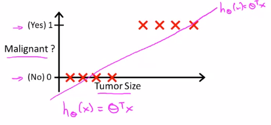

We can see that the hypothesis classifies the data points quite well. In order to classify the data, let us consider a threshold value of 0.5
Thus, all the data points above 0.5 will be classified into one class and the rest of the points will be classified as the other class.

Everything seems to be working fine till now. Let us now introduce another data as shown in the graph below -

<p align="center">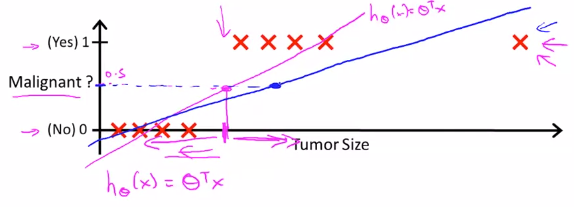

Now, the linear regression hypothesis looks somewhat different because of the new value.  

Because of the new hypothesis, most of the data will be missclassified. This is the problem of using linear regression for classification. Depending on the data linear regression might classify the data correctly or incorrectly.

Also, linear regression will give values which could be less than 0 and greater than 1 which is not required in a classification problem that needs its output in either 0 or 1. 

## Hypothesis Representation

The logistic regression requires the hypothesis to give values between the range of 0 and 1. In order to achieve that the sigmoid function or the logistic function is used.

The sigmoid function is shown below - 

<p align="center">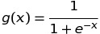

The graph for the same can also be found below - 

<p align="center">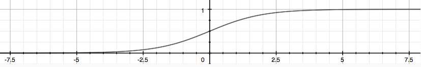

If the sigmoid function is used in the hypothesis of linear regression it can give valid results for logistic regression. 

Hence, the hypothesis for the logistic regression is as follows - 

<p align="center">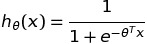

:warning: The logistic regression gives the output with respect to output value of ```y=1```, which means that if we get a binary classification problem of classifying tumors and we get the output as 0.7; this would imply that the person has 0.7 chance of having the tumor(i.e. result ```y=1``` has a 0.7 chance of occuring).

<p align="center">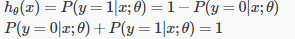

## Decision Boundary

If we have a closer look at the graph for the sigmoid function we'll realize that the value of ```g(z)``` is greater than or equal to ```0.5``` whenever z is greater than or equal to ```0```. And similarly, ```g(z)``` is less than ```0.5``` whenever ```z``` is less than ```0```. 

<p align="center">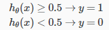

If we apply the same analogy to the hypothesis for logistic regression, we can conclude that the hypothesis will be greater or equal to zero whenever - 

<p align="center">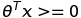

And the hypothesis will be less than zero when -

<p align="center">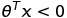

:warning: The **decision boundary** is the line that separates the area where y = 0 and where y = 1. It is created by our hypothesis function.

To summarize - 

<p align="center">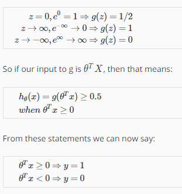

## Cost Function

We cannot use the same cost function that we use for linear regression because the Logistic Function will cause the output to be wavy, causing many local optima. In other words, it will not be a convex function.

The reason for this the sigmoid function present in the hypothesis. 

Therefore, we have to modify our cost function in such a way that it becomes convex. 

Here is how the new cost function - 

<p align="center">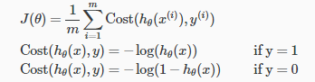

Here is a plot which shows the cost functions - 

<p align="center">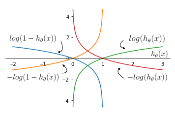

Below you can find the summary of the various values the cost function depending on the value of the hypothesis. 

<p align="center">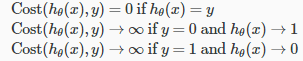

If our correct answer 'y' is 0, then the cost function will be 0 if our hypothesis function also outputs 0. If our hypothesis approaches 1, then the cost function will approach infinity.

If our correct answer 'y' is 1, then the cost function will be 0 if our hypothesis function outputs 1. If our hypothesis approaches 0, then the cost function will approach infinity.

## Simplified Cost Function and Gradient Descent

The two parts of the cost function can be combined together to make a simple equation that represents the two parts. 

The equation cen be found below - 

<p align="center">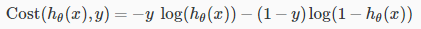

We can substitute this combined equation back into the cost function to get the full cost function, which is as follow - 

<p align="center">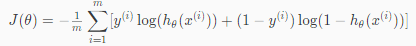

Now, if we calculate the partial derivation of the cost function and substitute the value inside the gradient descent equation we will get -

<p align="center">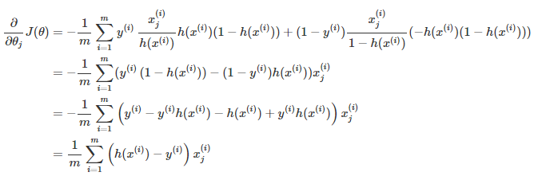

Also, the vectorized implementation for this can be found below - 

<p align="center">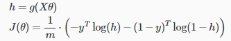

And the equation for gradient descent is as follows - 

<p align="center">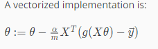

Other algorithms that can be used instead of gradient descent are - 

1.  Conjugate gradient
1.  BFGS
1.  L-BFGS

## Multiclass Classification: One vs All

Here we will see the classification of data when we have more than two categories. Instead of y = {0,1} we will expand our definition to y = {0,1...n}

<p align="center">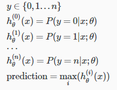

We are basically choosing one class and then lumping all the others into a single second class. We do this repeatedly, applying binary logistic regression to each case, and then use the hypothesis that returned the highest value as our prediction.

Here is how it would look like in the plot - 

<p align="center">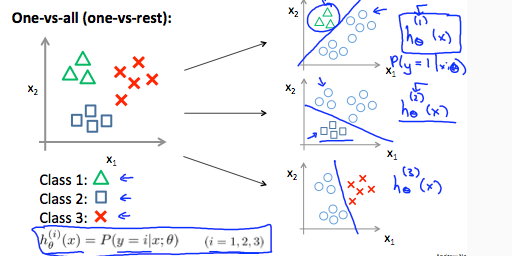

