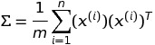
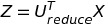

# Principal Component Analysis

Here are some awesome resources to learn about ```PCA``` -

1.  [Awesome survey paper](https://www.cs.princeton.edu/picasso/mats/PCA-Tutorial-Intuition_jp.pdf)
1.  [MachineLearningMastery Article](https://machinelearningmastery.com/calculate-principal-component-analysis-scratch-python/)
1.  [Article on implementing PCA step-by-step](http://sebastianraschka.com/Articles/2014_pca_step_by_step.html)
1.  [Another good article](https://glowingpython.blogspot.com/2011/07/principal-component-analysis-with-numpy.html)

## Introduction and Important points 

1.  ```PCA``` is done by transforming the variables to a new set of variables, which are known as the principal components (or simply, the PCs) and are orthogonal, ordered such that the retention of variation present in the original variables decreases as we move down in the order. 

:boom: So, in this way, the 1st principal component retains maximum variation that was present in the original components. 

1.  The **principal components are the eigenvectors of a covariance matrix**, and hence they are orthogonal.

1.  Dataset on which PCA technique is to be used must be scaled. Scaling is critical, while performing Principal Component Analysis(PCA). PCA tries to get the features with maximum variance and the variance is high for high magnitude features. This skews the PCA towards high magnitude features.

## Andrew NG's method

This section contains notes from Andrew NG's video on PCA. 

The following needs to be perform PCA - 

1.  Mean normalize the data by taking the mean of each feature present in the data and then subtract that mean from each value in the feature set
1.  After mean normalization, we need to calculate the ```Covariance matrix```. The equation for ```Covariance``` is given below - 

    <p align="center"></p>

    :warning: The sigma on the left hand side represents the covariance matrix whose size is ```N x N```. 

1.  After calculating the covariance matrix, the eigen vectors need to be calculated. This can be done using the SVD. 

    :radioactive: The eigenvectors represent the directions or components for the reduced subspace of B, whereas the eigenvalues represent the magnitudes for the directions. 

1.  On performing SVD, we get three matrices ```[U, S, V]```. The matrix ```U``` is of size ```N x N```. 

1.  In order to reduce the matrix to ```K``` dimension, only ```K``` columns need to be selected from the matrix ```U```.

1.  Finally, to get the required matrix of k dimension, the following can be done - 

    <p align="center"></p>

    :warning: In the above equation, the size of ```X``` is ```N X 1```. 


### More stuff

:warning:   The eigenvectors can be sorted by the eigenvalues in descending order to provide a ranking of the components or axes of the new subspace for A.

:exclamation: If all eigenvalues have a similar value, then we know that the existing representation may already be reasonably compressed or dense and that the projection may offer little. 

:radioactive: If there are eigenvalues close to zero, they represent components or axes of B that may be discarded.

:boom:  A total of m or less components must be selected to comprise the chosen subspace. Ideally, we would select **k eigenvectors**, called **principal components**, that have the **k largest eigenvalues**.