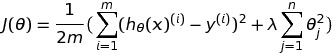
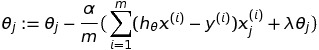
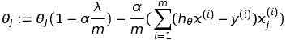
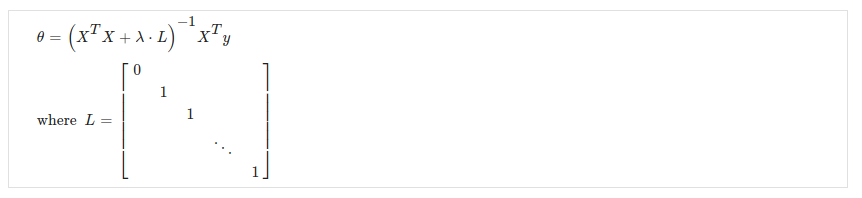
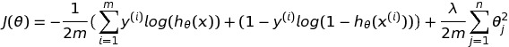
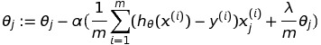

# Regularization

Learning algorithms might face underfitting and overfitting problems. For overfitting, ```regularization``` can be used to solve this issue. 

## Underfitting

Underfitting happens when the hypothesis doesn't represent the dataset well. Underfitting is when the form of our hypothesis ```function h``` maps poorly to the trend of the data. It is usually caused by a function that is too simple or uses too few features.

:warning: It is also known as **high bias**.

## Overfitting

**Overfitting**, **or high variance**, is caused by a hypothesis function that fits the available data but does not generalize well to predict new data. It is usually caused by a complicated function that creates a lot of unnecessary curves and angles unrelated to the data.

There are two main options to address the issue of overfitting:

1.  Reduce the number of features:

    *   Manually select which features to keep.
    *   Use a model selection algorithm

2.  Regularization

    *   Keep all the features, but reduce the magnitude of parameters ```theta```.
    *   Regularization works well when we have a lot of slightly useful features.

## Regularization to fix solve overfitting

Regularization is based on the following ideas - 

1.  Keep the values for ```theta``` small.
1.  Simpler hypothesis instead of complex ones. Simples hypothesis are less prone to overfitting. 

The cost function after including ```Regularization``` will look like this-

<p align="center"></p>

:warning:   ```lambda``` is the ```Regularization Parameter``` in the above eqaution.

## Regularized Linear Regression

The equation for gradient descent is as follows for the regularised linear regression function - 

<p align="center"></p>

On further simplifying the above eqaution we get this - 

<p align="center"></p>

:warning: The coefficient of ```theta``` in the above equation, will always be less than 1. This reduces the value of ```theta``` by some amount on every update. Notice that the second term is now exactly the same as it was before.

Also, the normal equation can be written as follows when regularization is applied to it - 

<p align="center"></p>

:boom: ```L``` is a matrix with 0 at the top left and 1's down the diagonal, with 0's everywhere else. It should have dimension ```(n+1)×(n+1)```. Intuitively, this is the identity matrix multiplied with a single real number λ.

Recall that if ```m < n``` (i.e. when the number of features is more than the number of rows of data), then the inverse term in the above equation is non-invertible. However, when we add the term λ⋅L, then the inverse term in the above equation becomes invertible.

## Regularized Logistic Regression

The regularized logistic regression is quite similar to regularized linear regression. 

The cost function for logistic regression with regularization is shown below - 

<p align="center"></p>

The equation for gradient descent on applying regularization will look like the following - 

<p align="center"></p>

:warning: In the above equation ```lambda``` is the regularization objective.